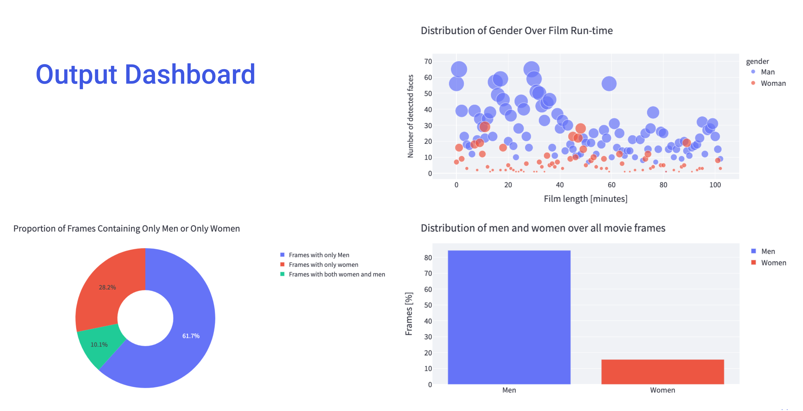

# Overview

Diversity in Hollywood uses deep learning to detect faces in
every key frame of a selected movie and generates a dashboard showing statistics
on gender and race representation, along with a composite "face of the movie"

Check out the platform [here](https://diversity-in-hollywood.herokuapp.com/)





## Model

We made use of an ensemble of CNN models, including Facebook’s DeepFace

## Training & Tunning

- We fine tuned the model to better classify gender and race by feeding it extra data of labeled face images

- We used a large-scale face dataset with nearly 200,000 face images with age, ethnicity, and gender tags including 6 race groups: Black, Asian, Indian, Latino, Middle East, and White, and 2 genders: Man, Woman.


## Pipeline 

- We created a pipeline which grabs key frames from movie-screencaps.com and stores them in a google storage bucket as image vectors to be used as input data.

- The frames are then automatically fed to the processing pipeline which detects faces using MTCNN and classifies them using the deep learning model.

- The results of the model are saved on GCP as dataframes with classifications per face, 
per frame for each movie.


## Creating the Dashboard

Our Streamlit forntend access the stored model data on GCP and and generates the dashboards in real-time


# How to contribute
- Always create a separate branch for new features 

    ```bash
    git branch [FEATURE_NAME]
    git checkout [FEATURE_NAME]
    ```
- Update the requirements.txt every time you use a new library
- Add and commit changes as soon as you mak them
- Create pull requests before merging your branch
- Comment your code and add function docstrings 
